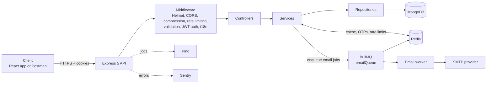
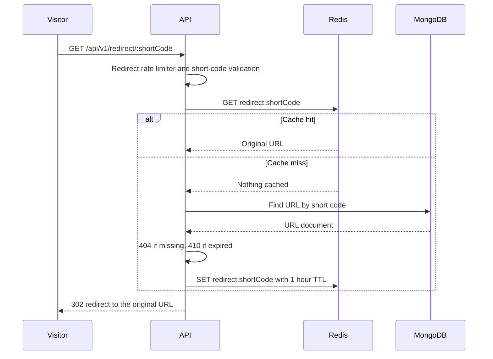
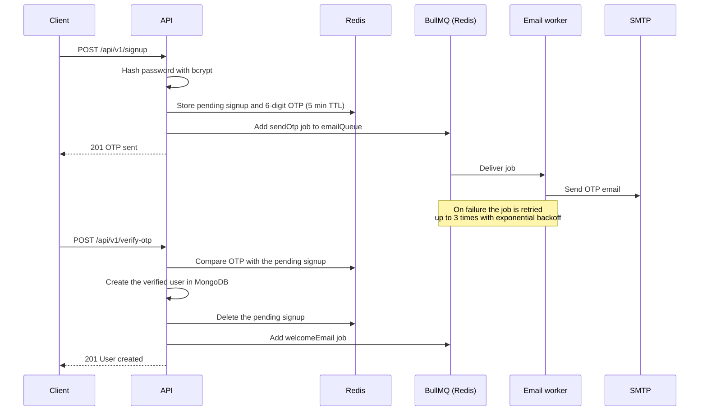
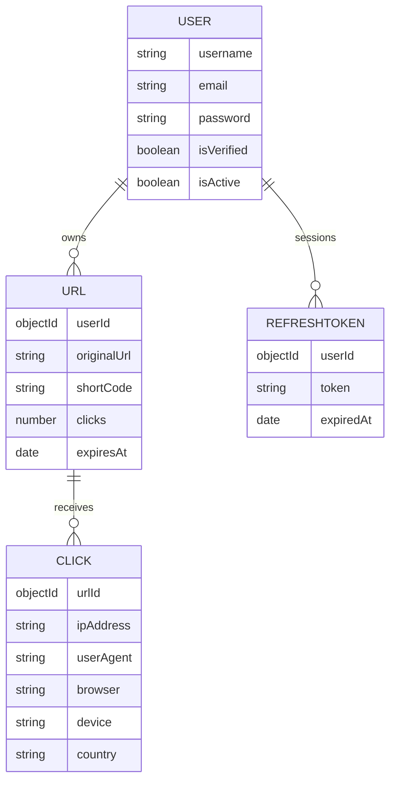
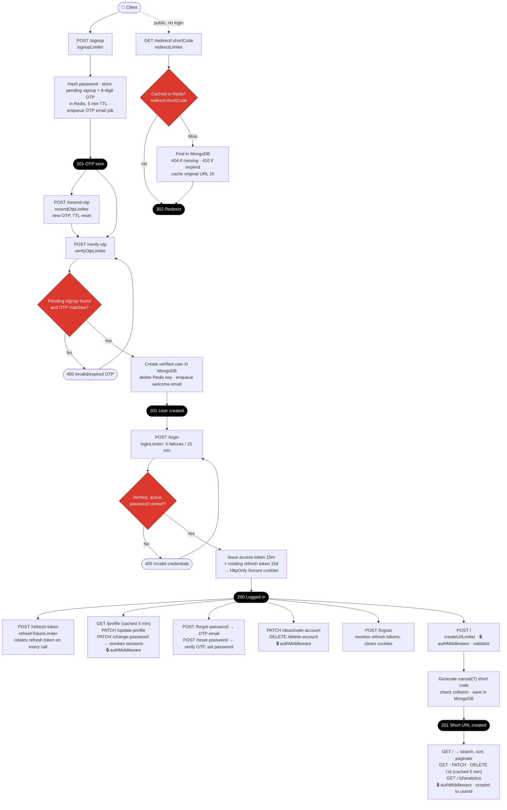
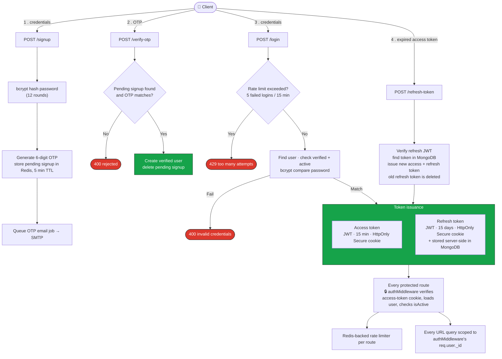
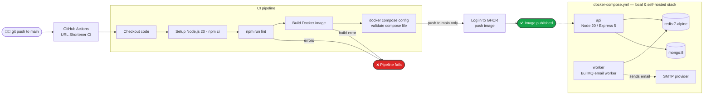

<div align="center">

# 🔗 URL Shortener API

**A production-style URL shortening service with OTP-verified accounts, Redis-cached redirects, and background email delivery powered by BullMQ.**

<p>
  <a href="https://github.com/nikhilsingh2764/URL-shortner/actions/workflows/ci.yml"></a>
  
  
  
  
  
  
</p>

<p>
  <a href="https://YOUR-LIVE-API-URL">Live API</a> ·
  <a href="https://YOUR-POSTMAN-COLLECTION-URL">Postman Collection</a>
</p>

</div>

---

## 📖 About

Long URLs are hard to share, remember, and track. This service turns a long URL into a short, unique code and redirects anyone who opens it to the original destination.

Every short URL belongs to an authenticated user, who can list, update, expire, and delete their own links. The public redirect endpoint is the hot path, so it is served from Redis first and only falls back to MongoDB on a cache miss.

The main goal was to build it the way a real service is built, not as a simple CRUD demo:

- **The redirect path is fast.** Short codes are cached in Redis for an hour, so most redirects never touch the database.
- **Slow work never blocks a request.** OTP, welcome, and password-reset emails are sent by a background worker (BullMQ on Redis) with automatic retries and exponential backoff.
- **Security is layered.** OTP email verification, bcrypt password hashing, short-lived JWT access tokens with rotating refresh tokens in HTTP-only cookies, per-user data scoping, and Redis-backed rate limiting on every sensitive endpoint.
- **It is easy to run and ship.** One `docker compose up` starts the whole stack, and a CI pipeline lints the code and builds the image on every push.

---

## ✨ Features

**URL shortening**
- Unique 7-character short codes generated with `nanoid`, with a collision check before saving
- Optional expiry date per URL; expired links return `410 Gone`
- List your URLs with pagination (max 100 per page), search by original URL, and sorting
- Update the destination or expiry, and delete a URL
- Click count per URL and an analytics endpoint

**Redirection**
- Public `GET /redirect/:shortCode` endpoint that answers with a `302` redirect
- Redis-first lookup with a one-hour cache and MongoDB fallback
- Dedicated rate limiter for the public redirect route

**Authentication & accounts**
- Email signup with a 6-digit OTP, plus OTP resend
- Login with 15-minute access tokens and 15-day refresh tokens in `HttpOnly`, `Secure` cookies
- Refresh tokens stored server-side and rotated on every use
- Forgot and reset password by OTP
- Profile, update profile, change password, logout, deactivate account, delete account

**Async processing**
- OTP, welcome, and password-reset emails sent over SMTP (Nodemailer) by a BullMQ worker
- Three attempts per job with exponential backoff

**Operations**
- Docker image and Docker Compose stack (API, worker, Redis, MongoDB)
- GitHub Actions pipeline: lint, build, validate, publish image
- Structured Pino logging and Sentry error tracking
- English and Hindi response messages with i18next

---

## 🏗️ Architecture



The code follows a strict layered structure: **routes → controllers → services → repositories → models**. Controllers handle HTTP only, services hold the business logic, and repositories are the only layer that talks to MongoDB.

### Example: redirecting a short URL



### Example: signup and OTP email



### Background queue

| Queue | Job names | Worker action |
| --- | --- | --- |
| `emailQueue` | `sendOtp`, `resetPasswordOtp`, `welcomeEmail` | Renders the HTML template and sends the email through SMTP |

The queue uses 3 attempts with exponential backoff and keeps the last 100 completed and failed jobs. The worker runs as its own container in Docker Compose (`node src/worker/email.worker.js`), so email delivery scales and restarts independently of the API.

---

## 🗄️ Data Model

Every URL belongs to a `USER`, and every URL query is scoped by that user's ID. Pending signups, OTPs, and cache entries live in Redis, not in MongoDB.



| Field | Purpose |
| --- | --- |
| `USER.password` | bcrypt hash (12 rounds), excluded from queries by default |
| `USER.isVerified` | Users are only created after the signup OTP is confirmed, so it is always `true` for stored users |
| `USER.isActive` | Set to `false` when the account is deactivated; deactivated accounts cannot log in |
| `URL.shortCode` | Unique, indexed 7-character code used in the redirect path |
| `URL.expiresAt` | Optional; redirects after this time return `410` |
| `REFRESHTOKEN.token` | Server-side copy used to validate, rotate, and revoke sessions |
| `CLICK` | Event model reserved for detailed analytics (browser, device, country, date range) |

---

## 🗺️ Route Flow (all endpoints)

A single end-to-end journey through every route, in the order a real client calls them — sign up, verify, log in, create a short URL, manage it, and follow it. Every step carries its rate limiter and, where it matters, its Redis or BullMQ behavior.



**How to read it for an interview walkthrough:**
- Follow the top path for the auth lifecycle: `signup → verify-otp → login → refresh-token`. Pending signups and OTPs live in Redis with a 5-minute TTL, the user document is only written after verification, tokens live in HttpOnly cookies, and refresh tokens rotate on every use.
- Follow the middle path for the core product loop: `create URL` → manage it with the `/:id` routes. Every query is scoped to the authenticated user.
- Follow the dotted path for the hot path: a public visitor hits `redirect`, and the Redis diamond decides whether MongoDB is touched at all.
- Every sensitive route carries its own Redis-backed rate limiter, so limits hold even if the API runs as several instances.

---

## 🛠️ Tech Stack

| Category | Technologies |
| --- | --- |
| **Runtime & framework** | Node.js 20, Express 5 (ES modules) |
| **Database** | MongoDB with Mongoose 9 |
| **Cache & queues** | Redis (ioredis), BullMQ |
| **Auth & security** | JWT (jsonwebtoken), bcrypt, Helmet, CORS, express-rate-limit with rate-limit-redis |
| **Validation & config** | express-validator, envalid |
| **Short codes** | nanoid |
| **Email** | Nodemailer over SMTP |
| **Observability** | Pino, pino-http, Sentry |
| **i18n** | i18next with English and Hindi message catalogs |
| **Performance** | compression |
| **DevOps** | Docker, Docker Compose, GitHub Actions, GitHub Container Registry |
| **Tooling** | ESLint, Git, Postman, Nodemon |

---

## 📁 Project Structure

```text
.
├── .github/workflows/ci.yml        # CI/CD pipeline
├── Backend/
│   ├── Dockerfile
│   ├── docker-compose.yml          # API + worker + Redis + MongoDB
│   ├── .dockerignore
│   ├── .env.example
│   ├── test.http                   # Quick HTTP requests
│   └── src/
│       ├── server.js               # Startup and process error handlers
│       ├── app.js                  # Middleware and route registration
│       ├── config/                 # db, env, redis, mail, logger, sentry, i18n
│       ├── routes/                 # authRoutes, urlRoutes
│       ├── controller/             # HTTP layer
│       ├── service/                # authService, urlService, email service
│       ├── repository/             # authRepository, urlRepository, clickRepository
│       ├── model/                  # user, refresh token, URL, click schemas
│       ├── validators/             # auth, url, analytics rules
│       ├── middleware/             # auth, rate limiters, validation, errors, TryCatch
│       ├── queues/                 # BullMQ email queue
│       ├── worker/                 # BullMQ email worker
│       ├── templates/              # OTP, reset-password, welcome emails
│       ├── locales/                # en and hi translations
│       └── utils/                  # ApiError, ApiResponse, tokens, OTP, cookie options
└── README.md
```

---

## 🔌 API Reference

Base path: `/api/v1`.

<details open>
<summary><b>Authentication</b></summary>

| Method | Endpoint | Auth | Description |
| --- | --- | --- | --- |
| POST | `/signup` | No | Start signup and send an OTP by email |
| POST | `/verify-otp` | No | Verify the OTP and create the account |
| POST | `/resend-otp` | No | Send a new OTP for a pending signup |
| POST | `/login` | No | Log in and set access and refresh cookies |
| POST | `/refresh-token` | Cookie | Rotate the refresh token and issue new tokens |
| POST | `/forgot-password` | No | Send a password-reset OTP |
| POST | `/reset-password` | No | Reset the password with the OTP |
| GET | `/profile` | Yes | Get the current user |
| POST | `/logout` | Yes | Log out and revoke refresh tokens |
| PATCH | `/update-profile` | Yes | Update profile details |
| PATCH | `/change-password` | Yes | Change password |
| PATCH | `/deactivate-account` | Yes | Deactivate the account |
| DELETE | `/delete-account` | Yes | Delete the account (password required) |

</details>

<details open>
<summary><b>Short URLs</b></summary>

| Method | Endpoint | Auth | Description |
| --- | --- | --- | --- |
| POST | `/` | Yes | Create a short URL |
| GET | `/` | Yes | List your URLs with pagination, search, and sorting |
| GET | `/:id` | Yes | Get one URL (Redis-cached) |
| PATCH | `/:id` | Yes | Update the original URL or expiry |
| DELETE | `/:id` | Yes | Delete a URL |
| GET | `/:id/analytics` | Yes | Get click statistics for a URL |
| GET | `/redirect/:shortCode` | No | Redirect to the original URL |

List query parameters: `page`, `limit` (max 100), `search`, `sort` (`createdAt`, `clicks`, `expiresAt`), `order` (`asc`, `desc`).

</details>

<details>
<summary><b>Example: shorten a URL</b></summary>

`POST /api/v1/` with a valid access cookie:

```json
{
  "originalUrl": "https://example.com/a/very/long/path?with=query&params=true",
  "expiresAt": "2026-12-31T23:59:59.000Z"
}
```

Response `201`:

```json
{
  "status": true,
  "statuscode": 201,
  "message": "Short URL created successfully",
  "data": {
    "id": "665f1c2e8a1b2c3d4e5f6a7b",
    "originalUrl": "https://example.com/a/very/long/path?with=query&params=true",
    "shortCode": "aB3xY_9",
    "shortUrl": "/api/v1/redirect/aB3xY_9",
    "clicks": 0,
    "expiresAt": "2026-12-31T23:59:59.000Z",
    "createdAt": "2026-09-20T10:15:00.000Z"
  }
}
```

Opening `/api/v1/redirect/aB3xY_9` answers with `302` and a `Location` header pointing at the original URL.

</details>

---

## 🔐 Security

| Area | Implementation |
| --- | --- |
| **Password storage** | bcrypt hashing with 12 salt rounds; the hash is never returned by default queries |
| **Email verification** | 6-digit OTP stored in Redis with a 5-minute expiry; the user document is created only after the OTP is verified |
| **Sessions** | 15-minute access token and 15-day refresh token, both in `HttpOnly`, `Secure`, `SameSite=Strict` cookies |
| **Refresh tokens** | Stored server-side and rotated on every use, so a used or revoked token stops working |
| **Session revocation** | Logout, password change, password reset, and account deactivation delete the user's stored refresh tokens |
| **Brute-force protection** | Redis-backed limiters on signup, OTP verify, OTP resend, login (failed attempts only), forgot and reset password, token refresh, logout, and password change |
| **Abuse protection** | Separate limiters for URL creation and the public redirect route |
| **Data isolation** | Every URL query is scoped by `_id` and the authenticated user's ID |
| **Cache safety** | Cached URL records are ownership-checked after they are read from Redis, so caching cannot bypass authorization |
| **HTTP hardening** | Helmet headers, CORS restricted to `CLIENT_URL` with credentials, `trust proxy` for deployment behind a load balancer |
| **Input validation** | express-validator rules on every write endpoint; only `http` and `https` URLs are accepted |
| **Errors** | One central error handler returns clean JSON to clients while details go to logs and Sentry |

### Rate limits

| Route | Limit | Window |
| --- | --- | --- |
| `POST /signup` | 5 | 1 hour |
| `POST /verify-otp` | 10 | 15 minutes |
| `POST /resend-otp` | 3 | 15 minutes |
| `POST /login` | 5 failed attempts | 15 minutes |
| `POST /forgot-password` | 5 | 15 minutes |
| `POST /reset-password` | 5 | 15 minutes |
| `POST /refresh-token` | 30 | 1 minute |
| `POST /logout` | 20 | 5 minutes |
| `PATCH /change-password` | 5 | 1 hour |
| `POST /` (create URL) | 20 | 15 minutes |
| `GET /redirect/:shortCode` | 100 | 1 minute |

### Authentication flow

The four steps a client goes through: **signup → verify OTP → login → refresh token**. Every protected route afterwards is checked by `authMiddleware`, and every URL query is scoped to `req.user._id`.



---

## ⚡ Redis Usage

| Data | Redis key | TTL | Invalidation |
| --- | --- | --- | --- |
| Redirect target | `redirect:{shortCode}` | 1 hour | Deleted when the URL is updated or deleted |
| URL detail | `url:{urlId}` | 5 min | Deleted on update or delete |
| User profile | `profile:{userId}` | 5 min | Deleted on profile update, deactivate, or delete |
| Pending signup + OTP | `signup:{email}` | 5 min | Deleted after verification |
| Password-reset OTP | `resetPassword:{email}` | 5 min | Deleted after a successful reset |
| Rate-limit counters | One prefix per limiter (`login:`, `verifyOtp:`, and so on) | Per limiter window | Expire by window |
| BullMQ email jobs | Managed by BullMQ | Last 100 completed and failed jobs kept | Automatic |

---

## 📊 Observability

- **Logs:** Pino writes structured JSON in production and pretty-printed logs in development. `pino-http` logs every request.
- **Errors:** Sentry captures unhandled errors, and the central error middleware returns a consistent JSON shape.
- **Process safety:** uncaught exceptions and unhandled promise rejections are logged as fatal before the process exits, so the container restarts cleanly.
- **Queue:** the worker logs every completed and failed email job with its job ID.

---

## 🚀 Getting Started

### Prerequisites

- Node.js 20 or later
- MongoDB (Atlas or local)
- Redis 7 or later
- An SMTP account for OTP and welcome emails (any provider, or a tool like Mailpit for local testing)

### Run locally

```bash
git clone https://github.com/nikhilsingh2764/URL-shortner.git
cd URL-shortner/Backend

cp .env.example .env      # then fill in your values
npm install
npm run dev               # API on http://localhost:8000
node src/worker/email.worker.js   # in a second terminal, sends the emails
```

### Run with Docker

```bash
cd Backend
cp .env.example .env      # required, the compose file reads it
docker compose up --build
```

| Service | Description | Port |
| --- | --- | --- |
| `api` | Express API | http://localhost:8000 |
| `worker` | BullMQ email worker (same image, different command) | — |
| `redis` | Redis 7 (cache, rate limits, queue) | 6379 |
| `mongo` | MongoDB 8 | 27017 |

The compose file overrides `REDIS_URL` and `MongoDB_URL` to point at its own containers, and the API waits for Redis and MongoDB health checks before starting.

### Scripts

| Command | What it does |
| --- | --- |
| `npm run dev` | Start the API with Nodemon |
| `npm start` | Start the API (production) |
| `npm run lint` | Run ESLint |

### Environment variables

| Variable | Description |
| --- | --- |
| `NODE_ENV` | `development`, `production`, or `testing` |
| `PORT` | Server port (default `8000`) |
| `CLIENT_URL` | Frontend origin allowed by CORS |
| `MongoDB_URL` | MongoDB connection string |
| `REDIS_URL` | Redis connection string |
| `JWT_ACCESS_SECRET` | Secret for signing access tokens |
| `ACCESS_TOKEN_EXPIRES_IN` | Access token lifetime, for example `15m` |
| `JWT_REFRESH_SECRET` | Secret for signing refresh tokens |
| `REFRESH_TOKEN_EXPIRES_IN` | Refresh token lifetime, for example `15d` |
| `SMTP_HOST` | SMTP server host |
| `SMTP_PORT` | SMTP server port |
| `SMTP_USER` | SMTP username |
| `SMTP_PASS` | SMTP password |
| `SMTP_FROM` | Sender address for outgoing email |
| `SENTRY_DSN` | Sentry project DSN |

Use long, random values for the token secrets. Never commit your `.env` file; commit `.env.example` with placeholder values instead.

---

## 🔄 CI/CD

Every push and pull request to `main` runs the pipeline in [`.github/workflows/ci.yml`](.github/workflows/ci.yml). A push to `main` also publishes the Docker image to GitHub Container Registry. The right-hand side of the diagram shows the Docker Compose stack used for local and self-hosted runs.



The pipeline fails if linting fails, the image does not build, or the compose file is invalid.

---

## 🧠 Design Decisions

- **Cache-first redirects:** the redirect route is the busiest path and the data rarely changes, so the original URL is cached in Redis for an hour and MongoDB is only touched on a miss.
- **`302`, not `301`:** a temporary redirect keeps every visit flowing through the API, so expiry, edits, and click counting keep working. A permanent redirect would be cached by browsers and bypass all three.
- **Short-code space:** a 7-character `nanoid` code has a 64-character alphabet, which is about 4.4 trillion combinations. The service checks for a collision before saving, and the unique index is the final safety net.
- **Pending signups in Redis:** the password hash and OTP wait in Redis for 5 minutes, and the user document is written only after verification. Abandoned signups expire on their own and never leave unverified rows in MongoDB.
- **Cache never bypasses ownership:** the cached URL record stores its `userId`, and the service compares it with the caller before returning it.
- **Rotating refresh tokens:** every refresh issues a new token and deletes the old one, so a stolen token that was already used stops working.
- **Tokens in HttpOnly cookies:** JavaScript on the page cannot read them, which reduces the damage of an XSS bug.
- **Queue instead of inline work:** third-party email calls are slow and can fail. Moving them to BullMQ keeps API latency low and gives retries and backoff for free.
- **Separate worker container:** the same image runs the API and the worker with different commands, so email delivery can be scaled or restarted without touching the API.
- **Repository layer:** database access lives in one place, which keeps services testable and makes the user-scoping rule easy to enforce.
- **Redis for shared state:** rate limits, OTPs, and cached data live in Redis, so the API can run as several instances without losing consistency.

---

## 🗺️ Roadmap

- [ ] Detailed click analytics (browser, device, country, and date-range statistics) using the `Click` model
- [ ] Custom aliases and QR-code generation
- [ ] Health, liveness, and readiness endpoints for Docker and uptime monitors
- [ ] Swagger UI (OpenAPI) documentation
- [ ] Automated tests (Jest and Supertest) wired into the CI pipeline
- [ ] Bull Board dashboard for monitoring the email queue and failed jobs
- [ ] Screening of submitted URLs against known malicious domains
- [ ] Custom domains and an advanced analytics dashboard

---

## 👨‍💻 Author

**Nikhil Singh**, Backend Engineer

[](https://www.linkedin.com/in/nikhil-singh-802594231/)
[](mailto:nikhilsingh2764@gmail.com)
[](https://github.com/nikhilsingh2764)

If you found this project useful, consider giving it a ⭐
